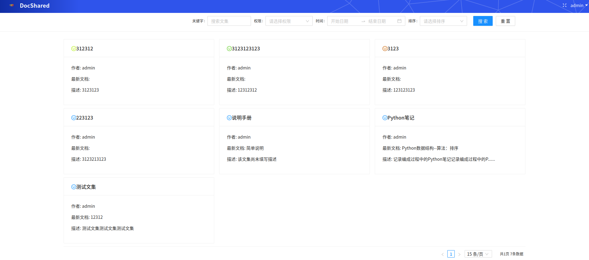
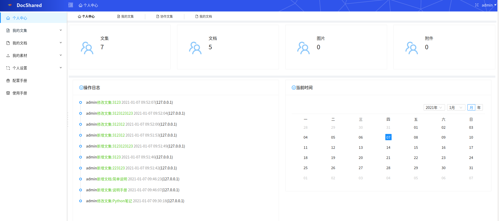
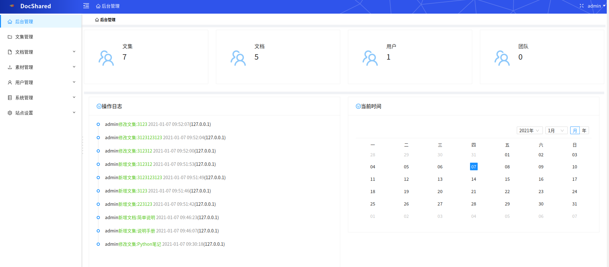

# 简介

DocShared 是基于Python + React 开发的在线文档管理系统，使用Django + Antd Design

DocShared 是一个适合个人或团队的在线文档分享工具，它可以加快团队之间沟通的效率，可以作为个人和团队的文档，知识和笔记管理工具

# 预览地址:

[DocShared](doc_demo.fualan.com)(网站尚在备案中, 暂无法访问, 请自行按照 “部署安装教程” 部署访问)


## 项目截图








# 功能

## 文档阅读

三栏式布局，目录层级显示，左侧文集大纲，中间文档正文，右侧文档目录

登录用户可查看文档历史记录/新增/克隆/编辑/导出等等

## 个人中心

文集管理：新建，删除，编辑，导入，导出，权限设置，成员设置，导出设置，转让

文档管理：新建，删除，编辑，导入模板，历史记录，草稿，发布，撤回

文档模板管理：新建，删除，编辑

文档标签管理：新建，删除，编辑

文档回收站管理：还原，清空

图片管理：上传，分组，删除

附件管理：上传，分组，删除

个人设置：个人信息、修改密码、账号Token管理

## 管理后台

用户管理： 新建，删除，编辑，禁用，启用，重置密码

团队管理： 新建，删除，编辑，成员设置

公告管理： 新建，删除，编辑，发布

日志管理： 查看

注册码管理： 新建，删除，编辑

验证码管理： 删除，编辑

站点设置： 站点信息，基础设置，邮箱设置

# 部署安装教程

## 1、拉取代码

```
git clone git@github.com:ScarecrowFu/docShared.git
```

进入代码目录

```shell script
cd docShared
```
## 2、安装后端依赖库

进入后端代码目录 `cd doc_backend`，安装依赖库

```shell script
python3 -m venv venv && source venv/bin/activate
```

```shell script
pip install -r requirements.txt -i https://mirrors.aliyun.com/pypi/simple --trusted-host=mirrors.aliyun.com
```

## 3、初始化数据库

运行如下命令生成数据库迁移

```shell script
python manage.py makemigrations doc_api
```

```shell script
python manage.py migrate
```

## 4、创建管理员账户

初始化完数据库之后，需要创建一个管理员账户

```shell script
python manage.py createsuperuser
```

## 5、运行后端接口

```shell script
python manage.py runserver
```

## 6、安装前端依赖库

进入前端代码目录 `cd doc_frontend`，安装依赖库

```shell script
npm install
```

## 7、运行前端页面

启动dev模式下的前端页面

```shell script
npm start
```

## 8、测试使用

访问 `http://localhost:3000`

# TODO

1. 文集导入

2. 文集导出(EPUB/PDF/Doc), 目前仅支持导出Markdown

3. 个人设置-->token 管理， 完善刷新token 功能

4. 注册功能(注册码/验证码)

5. 忘记密码功能(验证码)

6. 基础信息生效/邮箱设置生效

7. 公告展示

8. 用户禁用/启用

9. 回收站清空

10. 文档全文搜索

# 配置手册

[配置手册]()

# 使用手册

[使用手册]()